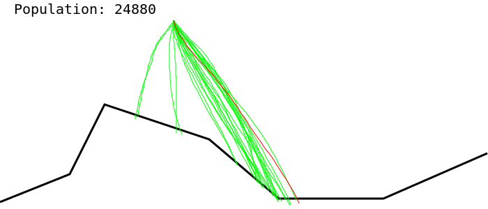

# Genetic Algorithm for [Mars Lander ep 2](https://www.codingame.com/ide/puzzle/mars-lander)

by Tooster

[repository with code](https://github.com/tooster-university/AI4Games/tree/master/src/main/kotlin/lander)

## Simulator

Tested on CodinGame - the number of random simulations in the first round of the game averaged on 1020 full simulations for a chromosome of length 200. Chromosome was each time replaced by new chromosome which genes were generated using Markov chain (each subsequent gene is generated from previous by randomly changing rotation by at most 15 degrees and power by at most one).

Error rate of simulated properties was observed to be:
| position | velocity | fuel | yaw | power |
| -------- | -------- | ---- | --- | ----- |
| +- 2m    | +-2m/s   | 0    | 0   | 0     |

## Does it even work on codingame?

As of now - I wasn't able to implement a solution that succesfully lands the vehicle. Either yaw or velocity are invalid.

## RHEA

RHEA was implemented in `rollingHorizonSolver(evolve, fit)`. `evolve` is the ranked population transformation function, while `fit` is a function returning fitness for a given chromosome. It operates on the following principle:

```
1. initialize the population using `evolve(emptyPopulation)`
2. forever:
    3. while we still have time to respond:
        4. evolve population (population should now be sorted)
        5. evaluate (simulate) all individuals in population
        6. rank the population by fitness
    7. print the first gene of the first chromosome in ranking
    8. roll the horizon by cutting off the first gene from each chromosome
    9. recalibrate simulation engine to represent current realtime sensors
```

## Evolution technique

First technique used was a variant of $(\lambda, \mu)\,EA$. where worst $\lambda$ chromosomes are replaced with uniformly mutated $\mu$ best chromosomes. This method had a tendency of converging pretty quickly to simmilar paths and low exploration of solution space.


## Visualization

Made by updating SVG graphics. Best Individual is colored red.