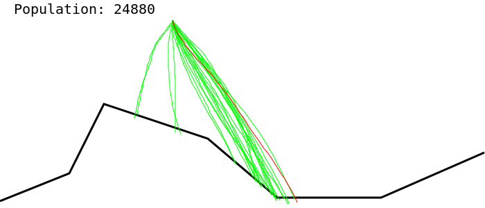

# Genetic Algorithm for [Mars Lander ep 2](https://www.codingame.com/ide/puzzle/mars-lander)
##### by Tooster

## Simulator
Tested on CodinGame - the number of rundom simulation in the first turn turned out (experimentally) to be ___

## Evolution technique
First technique used was a $(\lambda, \mu)\,EA$. Selected parameters

## Visualization
Made by updating SVG graphics. Best Individual is colored red.
