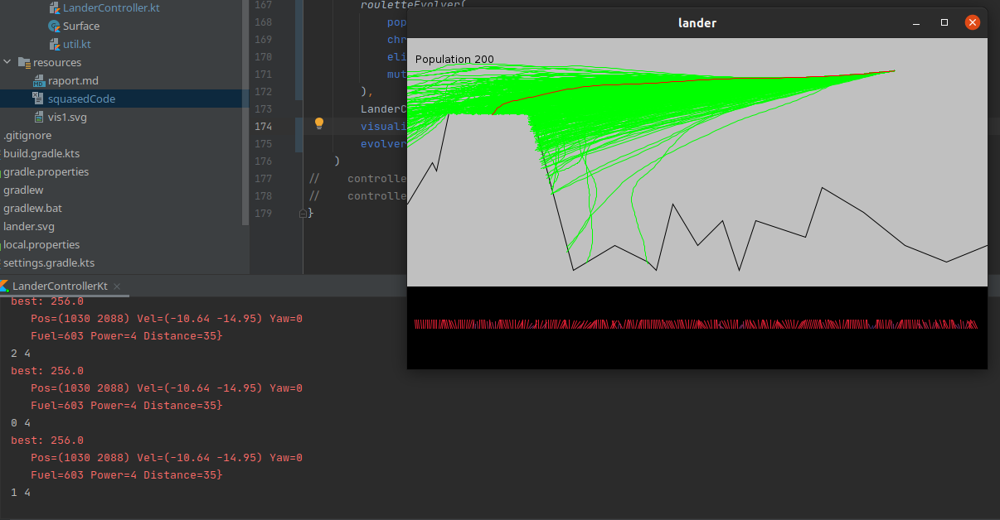
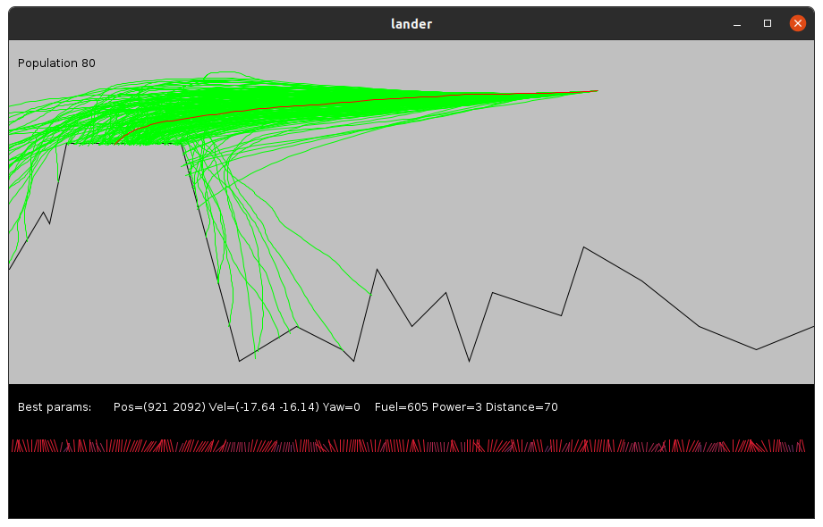
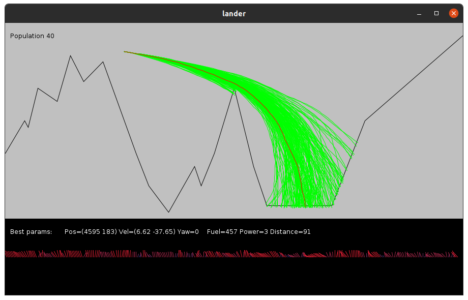
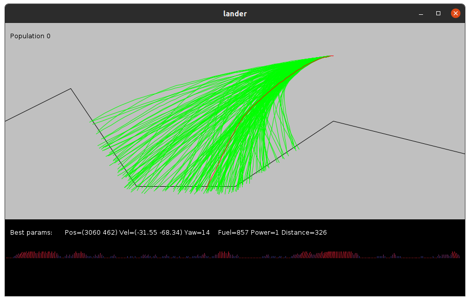

# Genetic Algorithm for [Mars Lander ep 2](https://www.codingame.com/ide/puzzle/mars-lander)

by Tooster

[repository with code](https://github.com/tooster-university/AI4Games/tree/master/src/main/kotlin/lander)

## Structure

Key structures used in this solver are:

- Action=Gene - representing target power and rotation for lander in a given timeslice
- Chromosome - organized list of actions, where each action has one timeslice assigned
- Population - a list of Chromosomes
- Ranking - List of tuples: `<Chromosome, params_after_simulation, fitness>`
- Evolver - transformation on ranking producing next generation
- fitness function - calculating how good a Chromosome is
- LanderParams - parameters representing state of a lander
- LanderController - holding current lander parameters, terrain data and world constants.
- solver - "brain" of LanderController that prints actions based on current state (also updates the state)

## Simulator

The average number of random simulations in the first round was around ~1200 for a chromosome of length 200. Chromosomes were replaced in every simulation.

### Error rate of simulated properties when simulating from start to finish:
| position | velocity | fuel | yaw | power |
| -------- | -------- | ---- | --- | ----- |
| +- 20m   | +-2m/s   | 0    | 0   | 0     |

In the version with recalibrating status of lander (read from input) error magnitude was similar.

## Does it even work on codingame?

~~As of now - I wasn't able to implement a solution that succesfully lands the vehicle. Either yaw or velocity are invalid.~~

After changing the evolution scheme and reworking code around immutability, all test cases in chapter 2 pass with some minor tuning of parameters per case. I found that optimal parameters for testing are:

1. 0.05 chance of mutation for any gene
2. Initial population of size 100-400
3. Initial chromosomes, where each gene differs by at most 5 degrees in yaw and 1 in thrust from his neighbor
4. Elitism on 10%-20% percent spectrum - i.e. copying best 10% solutions directly to next population
5. Chromosome Length of length 300

The best results so far were seen observed when evolutions for single round were performed for around a minute.

## RHEA

**RHEA** was implemented in the functon `LanderController.rollingHorizonSolver(evolve, fit)`. Parameters are: 

- `evolve: (Ranking) -> Population` - function transforming a ranked population (the best element is first) into next generation of population
- `fit: LanderController.(LanderParams) -> Double` - function returning fitness for a given parameters in context of the lander controller (accessing surface data, initial params and simmilar).

**RHEA** operates on the following principle:

```
1. initialize the population by `evolve(emptyPopulation)`
2. forever:
    1. while we still have time to respond:
        1. evolve population (input population is sorted)
        2. evaluate (simulate) all individuals in population
        3. rank the population by fitness
    2. print the first gene of the first chromosome in ranking
    3. roll the horizon by cutting off the first gene from each chromosome
    4. recalibrate simulation engine to represent current realtime sensors:
        a. if running in browser - read sensor data
        b. if running on PC - simulate next step from current params
```

## Fitness functions used

Several fitness functions were tested, but only the `score1` function produced satisfactory results. All of them are are defined inside `<<fits.kt>>` file. First tested function was a clever polynomial. Unfortunately any small tweaks to one parameter influenced global score, so this solution was rather quickly abolished. Similar situation with `linPenalty` function, which combines parameters into a polynomial of degree at most 1.

All of the functions use a metric refered too "distance from landing site" - this is a distance along the surface (including borders and the roof). It allows for solutions to "walk" on surface towards the goal.

For testing purposes a `crashPenalty` function was used, to see how fast a linear penalty dependent only on distance from landing site converges.

`penalty1` and `penalty2` were supposed to be a clever combination of all the parameters at the same tame. Unfortunately, lander didn't converge well, and dependency of score and parameters was unclear

`score1` an enchances the idea from `penalty1/2`, but now in reversed definition - we don't penalize solutions but reward them. The idea of those functions is to divide rewards into tiers - when primary goal (distance from flat site) is reached, we start thinking about the next objective - reducing speed. After that we can focus on proper rotation and eventuallly give small bonus for runs that use less fuel. To prevent jumping from tier to tier, we introduce a simple "soft margin" to the values params that satisfy us.

Distance is scaled relatively to the whole surface area  and scored on a scale of 0-90. Later when we hit the landing zone, a small margin (25% width from both sides) assigns points from 90-100. When we are the innermost 50% of the landing zone we get full 100 points.

We do something similar to the velocity, but now we use a slightly different metric to measure how good is the speed - previousle I tried using the `-1/x + 1` function when velocity was outside the acceptable range, but due to an asymptotic nature of the function didn't converge quickly enaugh. Instead I used a linear function that assigns 90 points if velocity is on the border of acceptable range and 0 and less if it's c.a. 10 times too big.

In the end we give a fuel-retained bonus and hardcoded 50 points to any solution that lands with rotation equal zero. This big jump and lack of margin ensures, that our lander will always try to quickly converge to angle 0 at the end, and not something close to 0.

## Evolution techniques

Two techniques were used to generate new population

### Random mutation pseudo-mu-lambda

The first one was a variant of $(\lambda, \mu)\,EA$, where worst $\lambda$ chromosomes are replaced with uniformly mutated $\mu$ best chromosomes. This method had a tendency of converging pretty quickly to simmilar paths and low exploration of solution space. This randomness was performing quite well in quickly finding the "not bad" solution, but it failed to improve it. We could find a path to the landing site in the *"EASY ON THE RIGHT"* level under 40 population of size 40, but all the landers crashed with either speed to big or invalid rotation. This method was tested with without `score1`.

### Roulette selection

The second aproach was to use weighted roulette to determine parents to crossover. Elitism was employed to increase the rate of convergence - 10%/20% of best chromosomes were directly copied to the next population. 

To combine parents and produce children, a linear interpolation of genes was performed - first a random number `frac` was selected, then children were produced: first one had genes that were pairwise linear interpolation between parents in the `frac` ratio. The other child had the `frac` inverted. After children were born, they were mutated and smoothed - each gene had a defined chance of randomly mutating (5% by default). Smoothing was performed to make the trajectory less "jagged" - more consistent rotation and power were choosen thanks to that. Smoothing takes each neighboring pair of genes and maps it into the average of the two. It is not the best way to do this, but it suffices.

## Results

the simulation output in the following form:

```
best: 256.0
   Pos=(1030 2088) Vel=(-10.64 -14.95) Yaw=0 
   Fuel=603 Power=4 Distance=35}
OK? true
```

tells us the best fitness so far, parameters for the landing position and if the landing was succesful (`OK?` line)

Every test case passes, but requires a little bit of tweaking to pass consistently. The randomness in my implementation is as of now nondeterministic, because I use unseeded functions to generate random numbers. Nevertheless I can say, that this algorithm passes all the basic cases - launched several times without changing a thing these are the results on codeforcess:


Most frequent case why the  algorithm fails is due to timeout.

## Example cases
### Case: High Ground (offline - 1000ms per round, population size 400)

Converges pretty quickly. Solution space is broad thanks to mutation policy. The best solution is found in the first two rounds.





### Case: Deep Canyon (offline - 1000ms per round, population size 400)


## Visualization

Made using Java SWING components.

First visualizator version operated on SVG components, but was missing realtime refreshing.


Current version of visualizer uses Java Swing components for drawing.


In the top left we have population indicator. Terrain is drawn with black polyline. Green and red paths trace the trajectory of a lander - red path is the best one that decides about the next action of a lander.

Underneath there is a small debug screen, showing predicted parameters for the best trajectory so far, and a visualization of current best chromosome - angle of segments indicates the rotation of aircraft, while color and length show the thrust.
